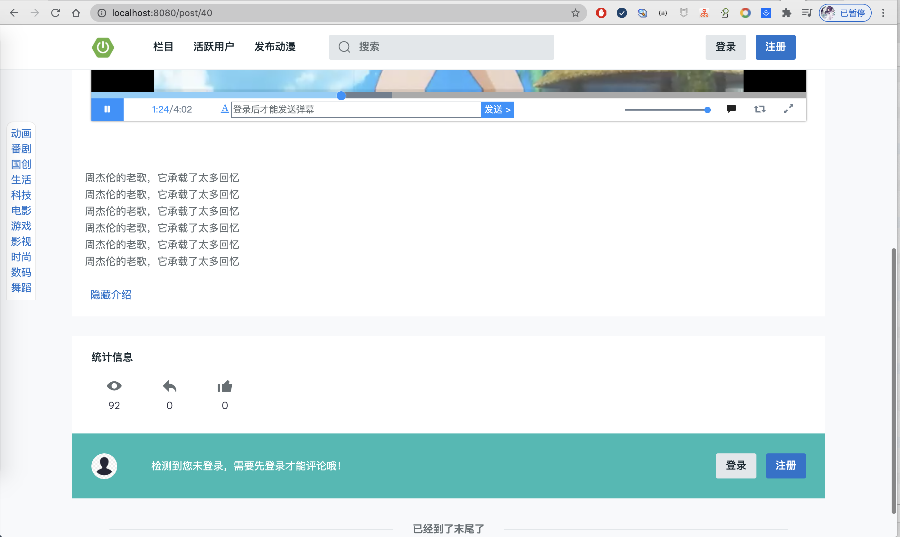

基于SpringBoot动漫网站，支持弹幕  
预览地址：[http://cartoon.liuyanzhao.com](http://cartoon.liuyanzhao.com)   
介绍地址：[https://liuyanzhao.com/shop/cartoon.html](https://liuyanzhao.com/shop/cartoon.html)   
需要完整代码联系博主，微信 847064370，提供源码和远程部署    
代码暂延缓开源，现在需要的直接联系博主。

## 项目说明
基于 springboot+mybatis+thymeleaf实现的动漫网站。 
优势：能发送弹幕、推荐使用协同过滤

## 功能介绍
- 包含游客、用户和管理员三种角色
- 游客可以只能看视频
- 用户可以发布视频、发送弹幕、留言、点赞等
- 管理员可以审核视频，视频管理、分类管理、标签管理、留言管理、用户管理等等

## 项目截图

## 联系方式
需要完整代码联系博主，微信847064370

